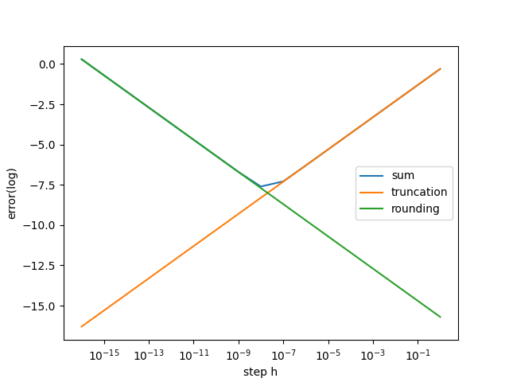

# report

- [report](#report)
  - [截断误差和舍入误差](#截断误差和舍入误差)
  - [无穷级数求和](#无穷级数求和)

陈张萌 2017013678

## 截断误差和舍入误差

如图所示，当步长较小时舍入误差占主导地位，步长较大时截断误差占主导地位。

## 无穷级数求和

1. IEEE单精度浮点数对无穷级数求和，结果不再变化时，有：`n = 2097152`,此时得到的运算结果`sum = 15.403683`。
单精度浮点数有$\epsilon_{mach}= 0.6 * 10^{-7}$。根据理论分析结果，当结果值停止变化时，会有：
$$\frac{1}{n}\leq\frac{1}{2}\epsilon_{mach}\sum_{k=1}^{n-1}\frac{1}{k}$$
而根据实验结果可知，当结果值停止变化时，有`n = 2097152`，$\sum_{k=1}^{n-1}\frac{1}{k} = 15.403682$，计算可得$\frac{1}{n}=4.5513465e-07$，$\frac{1}{2}\epsilon_{mach}\sum_{k=1}^{n-1}\frac{1}{k}=4.6211045e-07$，满足上式。

2. 双精度浮点数计算结果为`15.179888426694328`，误差为0.2238（保留4位有效数字）。

3. 双精度浮点数有$\epsilon_{mach}= 1.11 * 10^{-16}$，而我们发现
$$\sum_{n=1}^{x}{\frac{1}{n}} = \sum_{n=1}^{x}{lnx^\prime} \approx ln(x)$$
，因此1中的式子变为：
$$\frac{lnn}{n}\leq\frac{1}{2}\epsilon_{mach}\approx 0.55 * 10^{-16}$$
由此估计 $n \geq 7.48301 * 10^{17}$
假设双精度浮点数每秒可以计算$10^{9}$次，则需要24年。
